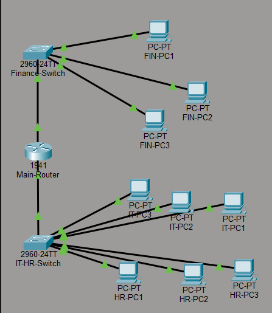
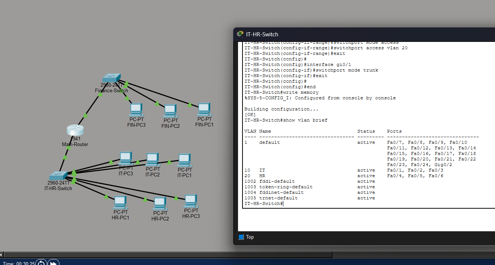
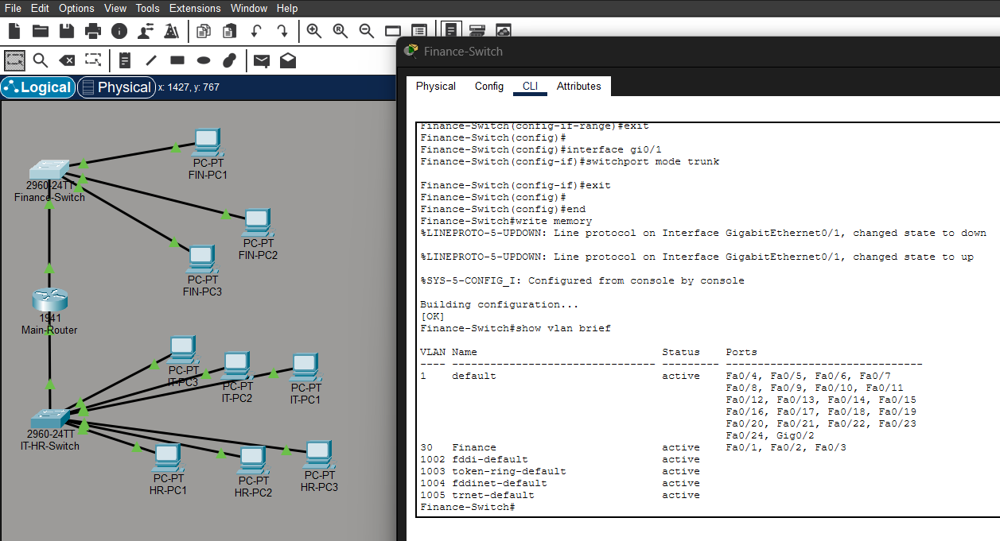
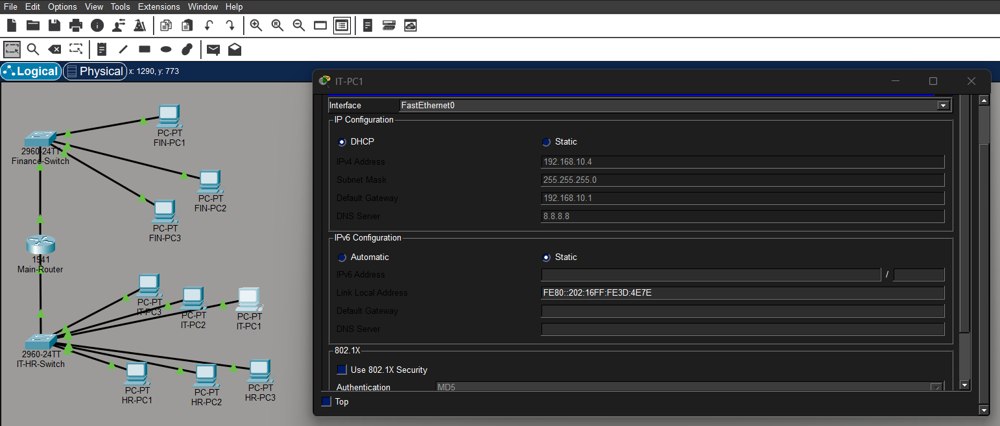
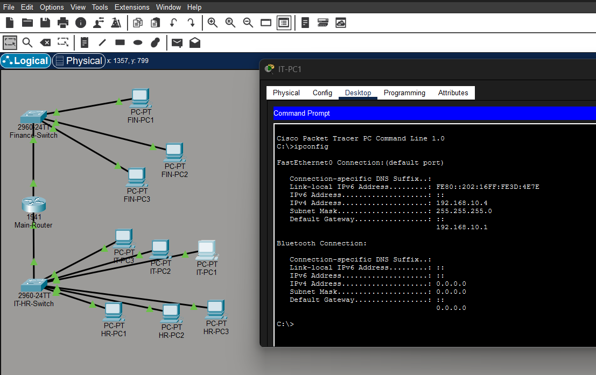

# 🏢 Enterprise Office Network Design

## 📖 Project Overview

This project demonstrates the design and implementation of an Enterprise Office Network using Cisco Packet Tracer.

The network is divided into three departments:

- 💻 IT Department (VLAN 10)
- 👥 HR Department (VLAN 20)
- 💰 Finance Department (VLAN 30)

The project implements VLAN segmentation, DHCP, trunking, and inter-VLAN routing using Router-on-a-Stick architecture.

---

## 🎯 Objectives

- Create separate VLANs for different departments
- Improve network segmentation and security
- Configure DHCP for automatic IP assignment
- Enable communication between VLANs
- Practice enterprise networking concepts

---

## 🛠️ Devices Used

| Device | Quantity |
|----------|----------|
| Cisco 1941 Router | 1 |
| Cisco 2960 Switch | 2 |
| PCs | 9 |

---

## 🌐 Network Topology

| Department | VLAN | Network Address |
|------------|------|----------------|
| IT | VLAN 10 | 192.168.10.0/24 |
| HR | VLAN 20 | 192.168.20.0/24 |
| Finance | VLAN 30 | 192.168.30.0/24 |

---

## ⚙️ Technologies Implemented

- VLAN Configuration
- Router-on-a-Stick
- DHCP Configuration
- Inter-VLAN Routing
- Trunk Ports
- Network Segmentation
- Connectivity Testing
- Cisco IOS CLI Configuration

---

## 📚 Skills Learned

### Networking

- VLAN Creation
- VLAN Assignment
- Trunk Configuration
- Inter-VLAN Communication
- DHCP Configuration
- Router Configuration
- Switch Configuration

### Troubleshooting

- Network Connectivity Testing
- Ping Verification
- DHCP Verification
- Interface Status Verification

### IT Administration

- Network Planning
- IP Address Management
- Basic Enterprise Network Design
- Cisco Device Management

---

## 📸 Project Screenshots

### 1️⃣ Network Topology

---

### 2️⃣ IT & HR VLAN Configuration

---

### 3️⃣ Finance VLAN Configuration

---

### 4️⃣ Router Interface Configuration

---

### 5️⃣ DHCP Configuration

---

### 6️⃣ IP Configuration Verification

---

### 7️⃣ Connectivity Testing

---

## 🔧 Configuration Summary

### VLAN Configuration

| VLAN ID | Department |
|----------|------------|
| 10 | IT |
| 20 | HR |
| 30 | Finance |

### Gateway Configuration

| VLAN | Gateway |
|--------|---------|
| VLAN 10 | 192.168.10.1 |
| VLAN 20 | 192.168.20.1 |
| VLAN 30 | 192.168.30.1 |

### DHCP Pools

| Department | Network |
|------------|---------|
| IT | 192.168.10.0/24 |
| HR | 192.168.20.0/24 |
| Finance | 192.168.30.0/24 |

---

## ✅ Testing Results

Successfully verified:

- VLAN creation
- VLAN assignment
- Trunk configuration
- DHCP functionality
- Automatic IP assignment
- Router-on-a-Stick configuration
- Inter-VLAN routing
- End-to-end connectivity

Ping tests completed successfully with 0% packet loss.

---

## 🚀 Key Takeaways

This project helped me understand:

- How enterprise networks are structured
- Why VLAN segmentation is important
- How routers enable communication between VLANs
- How DHCP simplifies IP management
- How to configure Cisco routers and switches using CLI
- Basic network troubleshooting techniques

---

## 🎓 Career Relevance

This project demonstrates practical skills relevant to:

- IT Support Engineer
- Network Support Technician
- System Administrator
- IT Administrator
- NOC Analyst
- Junior Network Engineer
- Cybersecurity Analyst

---

## 🛠️ Tools Used

- Cisco Packet Tracer
- Cisco IOS CLI

---

## 👨‍💻 Author

### Gokulkrishnan S

BCA Student | Networking & Cybersecurity Enthusiast

- GitHub: https://github.com/Gokulpvtr
- LinkedIn: https://www.linkedin.com/in/gokulkrishnan-bca/

---

⭐ If you found this project useful, feel free to explore my other networking and cybersecurity projects.
